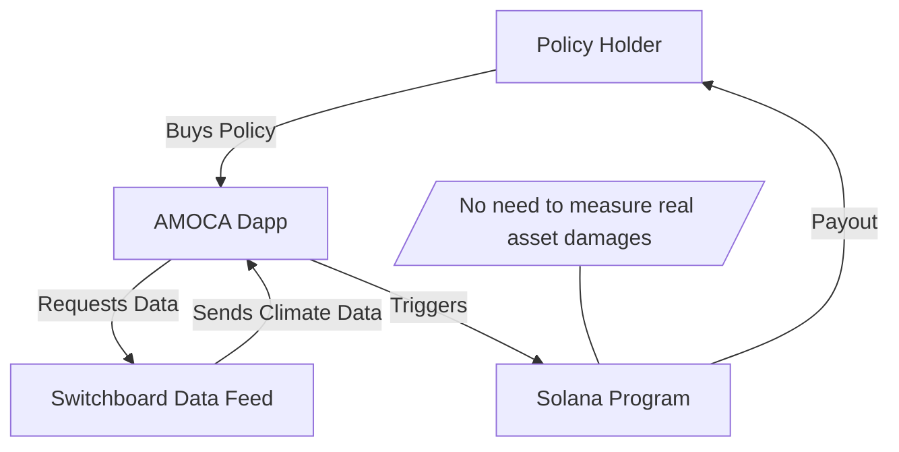

# AMOCA: Decentralized Climate Parametric Insurance Dapp

AMOCA is a decentralized application (dapp) built on the Solana blockchain, designed to provide parametric insurance solutions for climate-related risks. Leveraging the speed and scalability of Solana, AMOCA enables transparent, automated, and trustless insurance payouts based on real-world climate data.

Key features:

- **Parametric Insurance:** Automated payouts triggered by predefined climate parameters (e.g., rainfall, temperature, wind speed).
- **Decentralized & Transparent:** All policies and claims are managed on-chain, ensuring transparency and reducing the need for intermediaries.
- **Magic Block Scaleup:** Utilizes Magic Block technology to enhance scalability and performance, supporting large-scale adoption.
- **Solana Breakout Hackathon 2025:** AMOCA is developed as part of the Solana Breakout Hackathon 2025, showcasing innovation in decentralized insurance and climate resilience.

Join us in building the future of climate risk management on Solana!

## Workflow Diagram

- AMOCA leverages a custom on-demand data feed from Switchboard to obtain climate parameters.
- When a trigger condition is met, the Solana program automatically executes payouts to policy holders.
- This parametric approach eliminates the need to assess actual damages to real assets.
